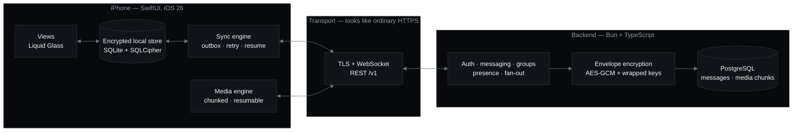

<div align="center">


# Toj

**Made for the signal you actually have.**

A cloud messenger built for Tajikistan's network — offline-first on the device,
encrypted in transit and at rest, and engineered to stay responsive on a
congested 3G link.

[](https://github.com/mmarufov/Toj/actions/workflows/ci.yml)
[](#building)
[](server/)
[](#project-status)

[Website](https://tojchat.tech) · [Documentation](docs/) · [Changelog](CHANGELOG.md) · [Architecture](#architecture)

</div>

---

## Project status

> **Pre-launch. Toj is not released and is not accepting users.**
>
> The client and backend are feature-complete and run against a private staging
> deployment. What stands between this repository and a public beta is
> **infrastructure, provisioning and field evidence — not features.** Calls are
> written and tested but *disabled in every deployed configuration*; the backend
> refuses to boot if their flags are set, because the release gates behind them
> are not met.

| Area | State |
| --- | --- |
| 1:1 and group messaging, media, search, sync | Built, tested, running on staging |
| Voice and video calls | Code complete; **disabled** — no TURN server deployed, release gates open |
| Group calls (LiveKit SFU) | Code complete; **disabled** |
| Push notifications | **Not provisioned** — needs an Apple Developer account and APNs keys |
| Secret Chats (true end-to-end) | **Not built.** The libsignal engine is in place; the feature is not |
| Validation on a real Tajik network | **Not done.** Blocked on device provisioning |
| In-country hosting | Planned for launch; staging runs in Frankfurt |

Current version: **`0.4.0.1`** — see the [changelog](CHANGELOG.md).

---

## Why Toj exists

Tajikistan routes effectively all international traffic through a single
state-controlled gateway, and that gateway throttles the messengers people
actually use. Telegram feels slow there for two compounding reasons: it is
targeted for throttling, *and* its servers are far away, so every packet makes
the round trip through a congested chokepoint.

That single fact drives every engineering decision in this repository:

1. **The network is assumed hostile.** The design target is a 3G worst case —
   100–500 kbps, high latency, jitter, packet loss, and sudden disconnection.
   Nothing may assume connectivity. Everything retries, resumes and degrades.
2. **Domestic traffic should stay domestic.** Keeping traffic inside the country
   means it never crosses the gateway at all. The service endpoint is a single
   swappable configuration value, so moving the backend in-country is a
   migration rather than a redesign.

The product answer is a **Telegram-style cloud messenger**: messages persist
server-side and sync across a user's devices, because that convenience is what
makes a messenger switchable. The privacy answer is *honest defaults plus an
opt-in maximum* — see [Security model](#security-model).

---

## Architecture



**The UI renders from the local store, never from the network.** A sent message
appears immediately and is confirmed later; a dropped connection is an expected
state rather than an error path. This is the single rule that makes the app feel
fast on a link where the round trip does not.

### Client — `Toj/`

Native Swift and SwiftUI targeting iOS 26, using the Liquid Glass design
language. All I/O, crypto and networking are asynchronous and cancellable;
the main thread never blocks.

| Path | Responsibility |
| --- | --- |
| `Toj/Core/Store/` | Encrypted local database (GRDB + SQLCipher) and the FTS5 search index — the UI's source of truth |
| `Toj/Core/Cloud/` | REST/WebSocket client, endpoint config, token storage, media transfer |
| `Toj/Core/Sync/` | Outbox, delivery/ack reconciliation, background wake-up |
| `Toj/Core/Transport/` | Connection management, reconnection and backoff |
| `Toj/Core/Calls/`, `Toj/Core/GroupCalls/` | WebRTC 1:1 calling and LiveKit SFU group calls |
| `Toj/Core/Crypto/` | libsignal engine, retained for Secret Chats |
| `Toj/Features/` | Feature UI — conversations, contacts, settings, calls, search |
| `Toj/DesignSystem/` | Shared theme primitives ([design system](docs/design-system.md)) |

### Backend — `server/`

Bun + TypeScript over PostgreSQL. This is the real backend, not a stand-in: it
persists messages encrypted at rest, syncs devices, and handles delivery, acks,
presence and fan-out over TLS + WebSocket. Media chunks live encrypted in
PostgreSQL rather than object storage.

Notable pieces: envelope encryption with wrapped per-account keys
(`envelope-crypto.ts`), versioned blind indexes for lookup without plaintext
(`blind-index.ts`), expand/contract SQL migrations (`schema-*.sql`), and
multi-channel OTP delivery over Telegram, SMS and WhatsApp (`*-otp.ts`).

The transport is deliberately ordinary. Toj does **not** implement a custom wire
protocol — looking exactly like normal HTTPS is the censorship-resistance
strategy, not an accident.

---

## Security model

Toj is a **secure cloud messenger, not a zero-access one**, and the README says
so plainly because marketing it otherwise would be the dangerous lie.

**Default (cloud) chats.** Messages are encrypted in transit and encrypted at
rest with server-held keys, using standard AEAD envelope encryption. They are
never stored as plaintext on disk. Because the server holds the keys, it *can*
decrypt — that is what makes cross-device sync, history restore and a new-device
login work. Access is gated and logged.

**Secret Chats.** The honest private mode: true end-to-end encryption via
[libsignal](https://github.com/signalapp/libsignal), where the server cannot
read content at all. Single-device by design. **This feature is not built yet** —
the crypto engine is in the repository, the user-facing feature is not.

**Ground rules.** No hand-rolled cryptography: standard AEAD and KMS primitives
at rest, libsignal for end-to-end. Plaintext, keys and full phone numbers are
never logged. Every dependency is pinned to an immutable revision, and CI
[fails the build](.github/workflows/ci.yml) if a GitHub Action is referenced by
anything other than a full commit SHA.

To report a vulnerability, see the [security policy](.github/SECURITY.md).
Please do not open a public issue.

---

## Getting started

### Prerequisites

| Requirement | Version |
| --- | --- |
| macOS with Xcode | 26.5+ (iOS 26 simulator runtime) |
| CocoaPods | any recent |
| [Bun](https://bun.sh) | 1.3.11 |
| PostgreSQL | 17.x |

### Building

Always open the **workspace**, not the `.xcodeproj` — the project uses CocoaPods.

```bash
git clone https://github.com/mmarufov/Toj.git
cd Toj

# Fetch the pinned, attested WebRTC XCFramework (verifies checksum + provenance)
scripts/fetch-webrtc-xcframework.sh

pod install
open Toj.xcworkspace          # scheme: Toj
```

Schemes: **`Toj`** builds and runs the app against a local relay and runs
`TojTests`. **`Toj Staging`** runs the same Debug app against the staging
backend — see [iOS staging](docs/ios-staging.md).

### Running the backend locally

```bash
cd server
bun install

createdb toj_dev
bun run migrate

PORT=8787 bun run server.ts   # simulators reach it on 127.0.0.1
```

### Tests

```bash
# iOS — ~537 tests
xcodebuild -workspace Toj.xcworkspace -scheme Toj \
  -destination 'platform=iOS Simulator,OS=26.5,name=iPhone 17 Pro' test
```

The backend suite runs against a real PostgreSQL, in a database of its own that
has to be migrated separately:

```bash
cd server
createdb toj_test
DATABASE_URL=postgres://localhost:5432/toj_test bun run migrate
```

Then run it **one file at a time**. The tests share a database, so a single
parallel `bun test` is not reliable — this loop is what CI does:

```bash
find . -path ./node_modules -prune -o -name '*.test.ts' -print | sort \
  | while read -r file; do bun test --timeout 15000 "$file" || break; done
```

If a run leaves the schema stale, drop and recreate `toj_test` and migrate again
rather than debugging the leftovers.

CI runs three jobs on every pull request: the backend suite against a live
PostgreSQL service, a signed iOS build and test run on a real simulator with the
genuine WebRTC binary, and a repository-policy job that verifies the privacy
manifest, dependency pins, coturn peer policy and action pinning.

---

## Repository layout

```
Toj/                      iOS client — Swift, SwiftUI
TojTests/                 iOS unit tests
TojUITests/               iOS UI tests
TojBroadcastExtension/    ReplayKit screen-share extension
server/                   Backend — Bun, TypeScript, PostgreSQL
infra/coturn/             TURN relay deployment template
scripts/                  Build, verification and codegen scripts
docs/                     Documentation and the tojchat.tech site
Dependencies/TojWebRTC/   Pinned WebRTC XCFramework (fetched, not committed)
```

---

## Documentation

Full index: [`docs/`](docs/).

| Document | What it covers |
| --- | --- |
| [Architecture](docs/architecture.md) | The deep version of the section above — data model, transport, encryption at rest, verification, known gaps |
| [Design system](docs/design-system.md) | Color, typography, spacing, motion, Liquid Glass rules |
| [Privacy data map](docs/privacy-data-map.md) | Collected data categories, machine-verified against the app's privacy manifest |
| [iOS staging](docs/ios-staging.md) | Running the app against the staging backend |
| [Backend staging](server/STAGING.md) | Deployment runbook for Render + Supabase |
| [Backend operations](server/OPERATIONS.md) | Retention, security conventions, rollout flags |
| [TURN relay](infra/coturn/README.md) | coturn deployment and capacity gates |
| [Release records](docs/releases/) | Voice and video call release evidence and open gates |
| [Design plans](docs/plans/) | Historical implementation plans for shipped features |

---

## Roadmap

- [x] End-to-end walking skeleton — libsignal → WebSocket → decrypt
- [x] Phone + OTP accounts, sessions, 2FA, prekey and session management
- [x] Offline-first local store and chat UI
- [x] Groups and media
- [x] Voice calls *(written; not enabled)*
- [x] Video calls *(written; not enabled)*
- [ ] **Validate on a real Tajik SIM** — the riskiest remaining unknown
- [ ] Apple Developer provisioning, APNs, push notifications
- [ ] Deploy TURN capacity and clear the call release gates
- [ ] In-country Tajikistan server; scale hardening and a paid database tier
- [ ] Secret Chats
- [ ] Android client

Out of scope until after the MVP: channels, bots, payments, server-side search.

---

## Contributing

Toj is a product codebase published openly. Please read
[CONTRIBUTING.md](.github/CONTRIBUTING.md) before opening an issue or a pull
request, and the [security policy](.github/SECURITY.md) before reporting
anything security-related.

## License

**Source-available, not open source.** Toj is published so it can be inspected
and audited; publication is not a grant of rights. See [LICENSE](LICENSE).

Third-party dependencies keep their own licenses, listed in [NOTICE.md](NOTICE.md)
— which also records an unresolved question worth knowing about before any build
is distributed: libsignal is AGPL-3.0 and is linked into the app.

<div align="center">
<sub>Toj — messaging, closer to home.</sub>
</div>
