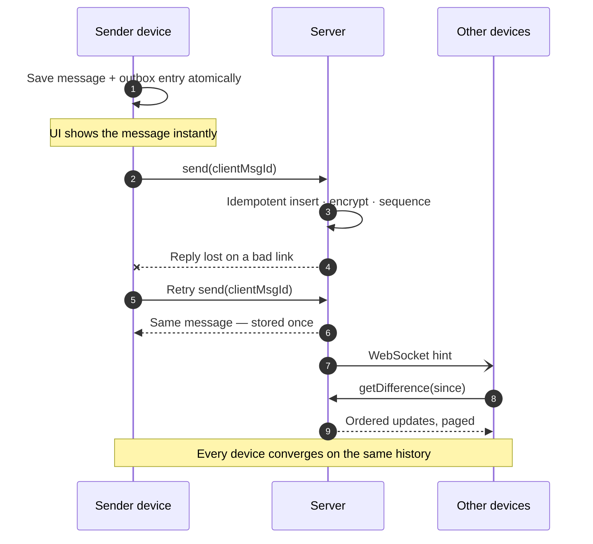

<div align="center">


# Toj

**A cloud messenger engineered for the network Tajikistan actually has.**

Offline-first on the device · encrypted in transit and at rest · sync proven under injected network faults

[](https://github.com/mmarufov/Toj/actions/workflows/ci.yml)
[](#getting-started)
[](Toj/)
[](server/)
[](#status-and-roadmap)

[Website](https://tojchat.tech) · [Architecture](docs/architecture.md) · [Engineering results](docs/results/) · [Changelog](CHANGELOG.md)

</div>

---

Toj is a native iOS messenger — 1:1 and group chat, media, multi-device sync,
voice and video calls — designed from the first commit around one fact: in
Tajikistan, the link between the phone and the server is slow, congested and
unreliable. Most international traffic leaves the country through a single
narrow gateway, so every round trip to a distant data center is expensive.

Toj's answer is to make the network **stop mattering to the user**. The app
renders from an encrypted on-device database, sends optimistically, and
reconciles in the background with a sync protocol that has been driven through
50,000 messages of injected packet loss, connection resets and dropped replies
without losing or duplicating a single one.

## Highlights

- **Instant on a 3G link.** The encrypted local store is the UI's source of
  truth. Views never wait on the network; a sent message appears immediately
  and is confirmed later. The design target is 100–500 kbps with jitter, loss
  and sudden disconnects.
- **Exactly-once delivery over an unreliable link.** Sends are idempotent by
  client message ID, and catch-up is ordered by a per-account sequence number,
  so a lost reply can never become a lost — or doubled — message.
- **Encrypted at rest by default.** Envelope encryption with AES-GCM and
  per-account wrapped keys, fenced key retirement, and versioned blind indexes
  so the server can look records up without storing what it is looking up.
- **Multi-device as a core feature.** Telegram-style cloud chats: history
  persists server-side, syncs across devices, and restores on a new login.
- **Unremarkable on the wire.** Standard TLS + WebSocket. No bespoke protocol,
  because a bespoke protocol is a fingerprint.
- **Verified, not asserted.** Pre-registered experiments with committed raw
  data, release gates enforced in code, and a fully pinned, attested supply
  chain.

## By the numbers

| | |
| --- | --- |
| **~1,000** automated tests | 538 iOS · 455 backend, run on every pull request |
| **50,000** messages under fault injection | **0** lost · **0** duplicated · **0** device mismatches across 5 fault profiles |
| **97 → 0** of 100 runs | Sync re-delivery race found by the fault harness, fixed, and re-measured |
| **4.01 s** | Worst-case p99 multi-device convergence, with server replies deliberately dropped |
| **4** CI jobs on every pull request | Backend on live PostgreSQL, signed iOS suite on a simulator, sync chaos smoke, repository policy |
| **100%** | GitHub Actions pinned to a full commit SHA — CI fails otherwise |

Methodology, environment and raw JSON for every figure: [sync under injected network faults](docs/results/sync-chaos.md).

---

## Architecture


```mermaid
%%{init: {"theme":"base","themeVariables":{
  "primaryColor":"#111318","primaryTextColor":"#F4F5F7","primaryBorderColor":"#2A2E36",
  "lineColor":"#6E7480","textColor":"#F4F5F7","fontSize":"14px",
  "clusterBkg":"#08090B","clusterBorder":"#2A2E36"
}}}%%
flowchart LR
    subgraph device["iPhone — SwiftUI, iOS 26"]
        UI["Views<br/>Liquid Glass"]
        Store[("Encrypted local store<br/>SQLite + SQLCipher")]
        Sync["Sync engine<br/>outbox · retry · resume"]
        Media["Media engine<br/>chunked · resumable"]
    end

    subgraph edge["Transport — ordinary HTTPS"]
        WS["TLS + WebSocket<br/>REST /v1"]
    end

    subgraph backend["Backend — Bun + TypeScript"]
        API["Auth · messaging · groups<br/>presence · fan-out"]
        Env["Envelope encryption<br/>AES-GCM + wrapped keys"]
        DB[("PostgreSQL<br/>messages · media chunks")]
    end

    UI <--> Store
    Store <--> Sync
    Sync <--> WS
    Media <--> WS
    WS <--> API
    API --> Env --> DB

    classDef n fill:#111318,stroke:#2A2E36,color:#F4F5F7
    class UI,Store,Sync,Media,WS,API,Env,DB n
    style device fill:#08090B,stroke:#2A2E36,color:#9096A1
    style edge fill:#08090B,stroke:#2A2E36,color:#9096A1
    style backend fill:#08090B,stroke:#2A2E36,color:#9096A1
```

### How a message moves


```mermaid
sequenceDiagram
    autonumber
    participant A as Sender device
    participant S as Server
    participant B as Other devices

    A->>A: Save message + outbox entry atomically
    Note over A: UI shows the message instantly
    A->>S: send(clientMsgId)
    S->>S: Idempotent insert · encrypt · sequence
    S--xA: Reply lost on a bad link
    A->>S: Retry send(clientMsgId)
    S-->>A: Same message — stored once
    S-)B: WebSocket hint
    B->>S: getDifference(since)
    S-->>B: Ordered updates, paged
    Note over A,B: Every device converges on the same history
```

### Client — [`Toj/`](Toj/)

Native Swift and SwiftUI on iOS 26 with the Liquid Glass design language. All
I/O, cryptography and networking are asynchronous and cancellable; the main
thread never blocks.

| Module | Responsibility |
| --- | --- |
| `Core/Store/` | Encrypted local database (GRDB + SQLCipher) and an on-device FTS5 search index |
| `Core/Sync/` | Outbox, multi-device convergence, presence, draft sync, network monitoring |
| `Core/Cloud/` | REST/WebSocket client, swappable endpoint config, token storage, chunked media |
| `Core/Transport/` | Connection lifecycle, reconnection and backoff |
| `Core/Calls/`, `Core/GroupCalls/` | WebRTC 1:1 calls and LiveKit SFU group calls with frame encryption |
| `Core/Crypto/` | libsignal engine for end-to-end Secret Chats |
| `Features/` | Conversations, contacts, settings, calls, search — logic in testable types, not views |
| `DesignSystem/` | Shared theme primitives — see the [design system](docs/design-system.md) |

### Backend — [`server/`](server/)

Bun + TypeScript over PostgreSQL: authentication, messaging, groups, media,
presence, delivery, acks and fan-out over TLS + WebSocket.

| Concern | Approach |
| --- | --- |
| **Encryption at rest** | Per-record data keys sealed with AES-GCM, wrapped by per-account keys; key material cached briefly and zeroized; retirement fenced so revocation cannot race an in-flight read (`envelope-crypto.ts`) |
| **Lookup without plaintext** | Versioned, domain-separated HMAC blind indexes — a digest from one context can never be replayed as a lookup in another, and the key rotates without a flag day (`blind-index.ts`) |
| **Zero-downtime schema changes** | Expand/contract migrations, with lock-free concurrent index builds in their own files (`schema-*-expand.sql`, `-contract.sql`, `-concurrent.sql`) |
| **Identity** | Phone number + OTP, delivered over multiple channels with explainable, pre-registered fraud rules (`otp-risk.ts`) |
| **Storage** | Media chunks live encrypted in PostgreSQL — one less service to reach across the gateway, one less place for plaintext to sit |

The deep version, including transport and calls: [docs/architecture.md](docs/architecture.md).

---

## Engineering approach

**Offline-first is the anti-lag rule.** On a link where a round trip can take
half a second on a good day, the only way to feel fast is to never wait for
one. Every interaction resolves against local data first.

**Faults are measured, not imagined.** A [Toxiproxy harness](server/chaos/)
drives headless clients through the real server and sync protocol under five
fault profiles — clean, 3G, connection resets, dropped replies and truncated
replies. It surfaced a cursor race that re-delivered updates in 97 of 100 runs;
after the fix, zero. A mild version runs in CI on every pull request.

**Experiments are pre-registered.** Hypotheses, metrics and thresholds are
committed *before* the first measurement run, and results are rendered from
committed raw data rather than copied by hand. The
[OTP fraud evaluation](docs/results/otp-fraud-replay.md) tuned on one set of
seeds and reported once on held-out seeds — including the attack shape the
rules do not yet handle well.

**Release gates are enforced in code.** Features that are built but not yet
cleared for rollout are not behind a toggle someone can flip by accident: the
server refuses to start if their flags are set before their
[release gates](docs/releases/) are met.

**The supply chain is pinned.** The WebRTC XCFramework is a reproducible build
published as an attested artifact and verified by checksum and provenance;
LibSignalClient is pinned by tag *and* prebuilt-FFI checksum; SwiftPM and
CocoaPods pins are asserted against reviewed revisions in CI.

---

## Security model

**Default (cloud) chats** are encrypted in transit and encrypted at rest using
standard AEAD envelope encryption with server-held keys — never stored as
plaintext. Server-held keys are what make cross-device sync, history restore
and new-device login work. Access is gated and logged.

**Secret Chats** are the opt-in private mode: true end-to-end encryption via
[libsignal](https://github.com/signalapp/libsignal), where the server cannot
read content at all. Single-device by design.

**Ground rules.** No hand-rolled cryptography. Plaintext, keys and full phone
numbers are never logged. Collected data categories are machine-verified
against the app's privacy manifest in CI ([privacy data map](docs/privacy-data-map.md)).

To report a vulnerability, follow the [security policy](.github/SECURITY.md) —
please do not open a public issue.

---

## Status and roadmap

Toj is **pre-launch**. The client and backend are feature-complete and running
against a private staging deployment; the remaining work is provisioning,
infrastructure and field validation.

| Capability | State |
| --- | --- |
| 1:1 and group messaging, media, search, multi-device sync | ✅ Running on staging |
| Phone + OTP accounts, sessions, two-step verification | ✅ Running on staging |
| Voice and video calls (1:1), group calls | 🟡 Implemented and tested · rollout gated on TURN capacity and device release gates |
| Push notifications | 🟡 Implemented · awaiting APNs provisioning |
| Field validation on Tajik mobile networks | ⏭ Next milestone |
| In-country hosting | ⏭ Launch milestone — the endpoint is a single swappable config value |
| Secret Chats | ⏭ Planned — libsignal engine already integrated |
| Android | ⏭ Planned |

Deliberately out of scope until after launch: channels, bots, payments and
server-side search.

---

## Getting started

### Prerequisites

| Requirement | Version |
| --- | --- |
| macOS with Xcode | 26.5+ (iOS 26 simulator runtime) |
| CocoaPods | recent |
| [Bun](https://bun.sh) | 1.3.11 |
| PostgreSQL | 17.x |

### Build the iOS app

```bash
git clone https://github.com/mmarufov/Toj.git
cd Toj

scripts/fetch-webrtc-xcframework.sh   # pinned WebRTC build, checksum + provenance verified
pod install
open Toj.xcworkspace                  # always the workspace, not the .xcodeproj
```

Scheme **`Toj`** runs the app against a local backend and runs `TojTests`.
Scheme **`Toj Staging`** runs it against staging — see [iOS staging](docs/ios-staging.md).

### Run the backend

```bash
cd server
bun install
createdb toj_dev && bun run migrate
PORT=8787 bun run server.ts           # simulators reach it on 127.0.0.1
```

### Run the tests

```bash
# iOS
xcodebuild -workspace Toj.xcworkspace -scheme Toj \
  -destination 'platform=iOS Simulator,OS=26.5,name=iPhone 17 Pro' test

# Backend — against a real PostgreSQL, one file at a time (the suites share a database)
cd server
createdb toj_test
export DATABASE_URL=postgres://localhost:5432/toj_test
bun run migrate
find . -path ./node_modules -prune -o -name '*.test.ts' -print | sort \
  | while read -r f; do bun test --timeout 15000 "$f" || break; done
```

To reproduce the fault-injection results, see
[Reproduce](docs/results/sync-chaos.md#reproduce).

---

## Repository layout

```
Toj/                      iOS client — Swift, SwiftUI
TojTests/, TojUITests/    iOS unit and UI tests
TojBroadcastExtension/    ReplayKit screen-share extension
server/                   Backend — Bun, TypeScript, PostgreSQL
server/chaos/             Network fault-injection harness
infra/coturn/             TURN relay deployment template
scripts/                  Build, verification and codegen scripts
docs/                     Documentation, results, and the tojchat.tech site
```

## Documentation

| Document | What it covers |
| --- | --- |
| [Architecture](docs/architecture.md) | Data model, transport, encryption at rest, calls, verification |
| [Engineering results](docs/results/) | Pre-registered experiments with committed raw data |
| [Design system](docs/design-system.md) | Color, typography, spacing, motion, Liquid Glass rules |
| [Privacy data map](docs/privacy-data-map.md) | Data categories, machine-verified against the privacy manifest |
| [Backend staging](server/STAGING.md) · [Operations](server/OPERATIONS.md) | Deployment runbook, retention and security conventions |
| [TURN relay](infra/coturn/README.md) | coturn deployment and capacity gates |
| [Release records](docs/releases/) | Call release evidence and gates |

Full index: [`docs/`](docs/).

## Contributing

Please read [CONTRIBUTING.md](.github/CONTRIBUTING.md) before opening an issue
or pull request, and the [security policy](.github/SECURITY.md) before
reporting anything security-related.

## License

Source-available: published for inspection and audit, all rights reserved —
see [LICENSE](LICENSE). Third-party components retain their own licenses,
listed in [NOTICE.md](NOTICE.md).

<div align="center">
<br />
<sub><b>Toj</b> — messaging, closer to home.</sub>
</div>
