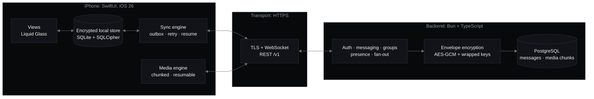
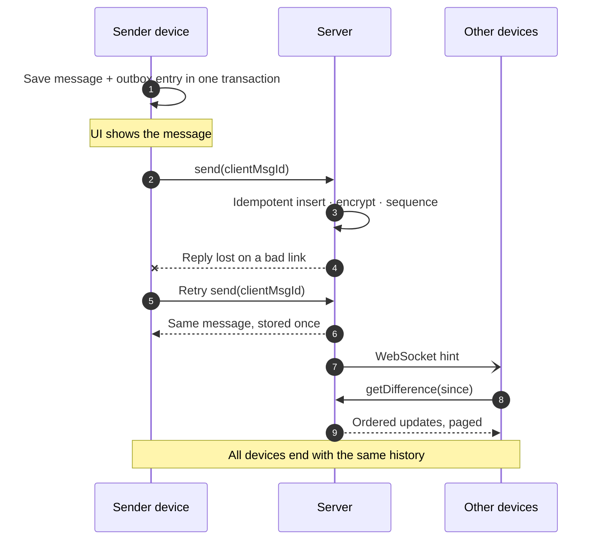

<div align="center">


# Toj

**An offline-first cloud messenger for slow and unreliable networks.**

[](https://github.com/mmarufov/Toj/actions/workflows/ci.yml)
[](#getting-started)
[](Toj/)
[](server/)
[](#status)

[Website](https://tojchat.tech) · [Architecture](docs/architecture.md) · [Test results](docs/results/) · [Changelog](CHANGELOG.md)

</div>

---

Toj is a messaging app for iPhone with 1:1 and group chats, media, multi-device
sync, and voice and video calls. It is designed for mobile networks where
100-500 kbps, high latency, packet loss and dropped connections are normal.

The app reads from and writes to an encrypted database on the phone, so the
interface never waits for the server. Messages are sent in the background and
retried until the server confirms them, and every device catches up from the
same ordered history.

## Features

- **Offline-first client.** Chats, drafts and search work from local data
  (SQLite with SQLCipher). A sent message shows up right away and is marked
  delivered when the server acknowledges it.
- **Idempotent sends.** Each message carries a client-generated ID and the
  server stores one message per ID, so retrying after a lost reply is safe.
  After a reconnect, devices fetch what they missed in order, by sequence
  number.
- **Encryption at rest.** Message content is sealed with AES-GCM under
  per-record keys, which are wrapped by per-account keys. Lookups go through
  HMAC blind indexes, so the server can find a record without storing the value
  it searches by.
- **Multi-device sync.** History is stored on the server, synced to every
  signed-in device, and restored on a new login.
- **Standard transport.** TLS and WebSocket over HTTPS, with no custom wire
  protocol.
- **Calls.** 1:1 voice and video over WebRTC, and group calls through a LiveKit
  SFU with frame encryption. They are built and tested, and will be switched on
  once the call servers are deployed.

## Test results

| Area | Result |
| --- | --- |
| Automated tests | 538 iOS and 455 backend tests on every pull request |
| Sync under network faults | 50,000 messages across 5 fault profiles: 0 lost, 0 duplicated, 0 mismatches between devices |
| Sync re-delivery bug | Found by the fault harness in 97 of 100 runs, 0 of 100 after the fix |
| Convergence time | 4.01 s worst-case p99 for all devices to match, with server replies dropped on purpose |
| CI | 4 jobs per pull request; every GitHub Action pinned to a full commit SHA |

Method, machine details and raw data: [docs/results/sync-chaos.md](docs/results/sync-chaos.md).

---

## Architecture


```mermaid
%%{init: {"theme":"base","themeVariables":{
  "primaryColor":"#111318","primaryTextColor":"#F4F5F7","primaryBorderColor":"#2A2E36",
  "lineColor":"#6E7480","textColor":"#F4F5F7","fontSize":"14px",
  "clusterBkg":"#08090B","clusterBorder":"#2A2E36"
}}}%%
flowchart LR
    subgraph device["iPhone: SwiftUI, iOS 26"]
        UI["Views<br/>Liquid Glass"]
        Store[("Encrypted local store<br/>SQLite + SQLCipher")]
        Sync["Sync engine<br/>outbox · retry · resume"]
        Media["Media engine<br/>chunked · resumable"]
    end

    subgraph edge["Transport: HTTPS"]
        WS["TLS + WebSocket<br/>REST /v1"]
    end

    subgraph backend["Backend: Bun + TypeScript"]
        API["Auth · messaging · groups<br/>presence · fan-out"]
        Env["Envelope encryption<br/>AES-GCM + wrapped keys"]
        DB[("PostgreSQL<br/>messages · media chunks")]
    end

    UI <--> Store
    Store <--> Sync
    Sync <--> WS
    Media <--> WS
    WS <--> API
    API --> Env --> DB

    classDef n fill:#111318,stroke:#2A2E36,color:#F4F5F7
    class UI,Store,Sync,Media,WS,API,Env,DB n
    style device fill:#08090B,stroke:#2A2E36,color:#9096A1
    style edge fill:#08090B,stroke:#2A2E36,color:#9096A1
    style backend fill:#08090B,stroke:#2A2E36,color:#9096A1
```

### Sending a message


```mermaid
sequenceDiagram
    autonumber
    participant A as Sender device
    participant S as Server
    participant B as Other devices

    A->>A: Save message + outbox entry in one transaction
    Note over A: UI shows the message
    A->>S: send(clientMsgId)
    S->>S: Idempotent insert · encrypt · sequence
    S--xA: Reply lost on a bad link
    A->>S: Retry send(clientMsgId)
    S-->>A: Same message, stored once
    S-)B: WebSocket hint
    B->>S: getDifference(since)
    S-->>B: Ordered updates, paged
    Note over A,B: All devices end with the same history
```

### Client ([`Toj/`](Toj/))

Swift and SwiftUI on iOS 26, using Liquid Glass. I/O, cryptography and
networking run off the main thread and can be cancelled.

| Module | Responsibility |
| --- | --- |
| `App/` | App entry point, root view, and `CloudAppModel`, the shared state the screens bind to |
| `Core/Store/` | Encrypted local database (GRDB + SQLCipher) and an on-device FTS5 search index |
| `Core/Sync/` | Outbox, multi-device sync, presence, draft sync, network monitoring |
| `Core/Cloud/` | REST/WebSocket client, endpoint config, token storage, chunked media |
| `Core/Transport/` | Connection lifecycle, reconnection and backoff |
| `Core/Calls/`, `Core/GroupCalls/` | WebRTC 1:1 calls and LiveKit SFU group calls with frame encryption |
| `Core/Crypto/` | libsignal engine for the planned Secret Chats |
| `Features/` | Screens by feature: messaging and search, contacts, groups, profile, settings, calls, group calls |
| `DesignSystem/` | Shared theme components (see the [design system](docs/design-system.md)) |

### Backend ([`server/`](server/))

Bun and TypeScript over PostgreSQL. It handles accounts, messaging, groups,
media, presence, delivery receipts and fan-out over TLS and WebSocket.

| Area | Approach |
| --- | --- |
| Encryption at rest | Each record has its own data key, sealed with AES-GCM and wrapped by a per-account key. Unwrapped keys are cached briefly and zeroed after use. Retiring a key stops new unwraps first, then waits for cached copies to expire before deleting (`envelope-crypto.ts`) |
| Lookups | Versioned HMAC blind indexes with a separate key domain per use (phone lookup, OTP codes, tokens and others), so a digest made for one domain can't be used in another. The index key can be rotated (`blind-index.ts`) |
| Schema changes | Expand/contract migrations, with concurrent index builds in separate files so deploys don't lock tables (`schema-*-expand.sql`, `-contract.sql`, `-concurrent.sql`) |
| Sign-in | Phone number and one-time code over Telegram, WhatsApp or SMS, with fraud rules that record the reason for every block (`otp-risk.ts`) |
| Media storage | Media chunks are stored encrypted in PostgreSQL, which avoids running a separate object store |

More detail, including transport and calls: [docs/architecture.md](docs/architecture.md).

---

## Engineering practices

- **Fault-injection testing.** A [Toxiproxy harness](server/chaos/) runs four
  headless clients against the real server under five network profiles: clean,
  3G, connection resets, dropped replies and truncated replies. A shorter run is
  part of CI.
- **Pre-registered experiments.** Plans, metrics and pass thresholds are
  committed before the first measurement, and result tables are generated from
  the committed raw data. The [OTP fraud evaluation](docs/results/otp-fraud-replay.md)
  was tuned on one set of seeds and then run once on held-out seeds.
- **Release gates in code.** The staging server refuses to start if a call
  feature flag is set. The flags stay off until the
  [release gates](docs/releases/) are met.
- **Pinned dependencies.** The WebRTC framework is a reproducible build that CI
  checks by checksum and build attestation. LibSignalClient is pinned by tag
  and by the checksum of its prebuilt library. SwiftPM and CocoaPods versions
  are checked against reviewed revisions.

---

## Security model

Default chats are encrypted in transit with TLS and at rest with AEAD envelope
encryption. The server holds the keys, which is what lets history sync across
devices and come back after a new login. Access to stored content is gated and
logged.

Secret Chats are planned as an opt-in mode with end-to-end encryption through
[libsignal](https://github.com/signalapp/libsignal). The server will not be able
to read them, and each one will live on a single device.

Toj uses standard cryptographic primitives and libraries only. Logs never
contain message content, keys or full phone numbers. CI checks the app's
privacy manifest against the [privacy data map](docs/privacy-data-map.md).

To report a vulnerability, follow the [security policy](.github/SECURITY.md)
and please don't open a public issue.

---

## Status

Toj is pre-launch. The app and backend are feature-complete and run on a
private staging server. The remaining work is provisioning, infrastructure and
testing on real mobile networks.

| Area | State |
| --- | --- |
| 1:1 and group messaging, media, search, multi-device sync | Running on staging |
| Phone sign-in, sessions, two-step verification | Running on staging |
| Voice and video calls, group calls | Built and tested; off until TURN servers are deployed and the release gates pass |
| Push notifications | Built; needs APNs provisioning |
| Field testing on carrier networks | Next |
| Hosting close to users | Planned for launch; the server address is one config value |
| Secret Chats | Planned; the libsignal engine is already in the app |
| Android | Planned |

Channels, bots, payments and server-side search come after launch.

---

## Getting started

### Prerequisites

| Requirement | Version |
| --- | --- |
| macOS with Xcode | 26.5+ (iOS 26 simulator runtime) |
| CocoaPods | recent |
| [Bun](https://bun.sh) | 1.3.11 |
| PostgreSQL | 17.x |

### Build the iOS app

```bash
git clone https://github.com/mmarufov/Toj.git
cd Toj

scripts/fetch-webrtc-xcframework.sh   # downloads the pinned WebRTC build and verifies it
pod install
open Toj.xcworkspace                  # open the workspace (CocoaPods)
```

Scheme **`Toj`** runs the app against a local backend and runs `TojTests`.
Scheme **`Toj Staging`** runs it against staging. See [iOS staging](docs/ios-staging.md).

### Run the backend

```bash
cd server
bun install
createdb toj_dev && bun run migrate
PORT=8787 bun run server.ts           # simulators reach it on 127.0.0.1
```

### Run the tests

```bash
# iOS
xcodebuild -workspace Toj.xcworkspace -scheme Toj \
  -destination 'platform=iOS Simulator,OS=26.5,name=iPhone 17 Pro' test

# Backend: real PostgreSQL, one file at a time (the suites share a database)
cd server
createdb toj_test
export DATABASE_URL=postgres://localhost:5432/toj_test
bun run migrate
find . -path ./node_modules -prune -o -name '*.test.ts' -print | sort \
  | while read -r f; do bun test --timeout 15000 "$f" || break; done
```

Steps to reproduce the fault-injection run are in
[docs/results/sync-chaos.md](docs/results/sync-chaos.md#reproduce).

---

## Repository layout

```
Toj/                      iOS client (Swift, SwiftUI)
TojTests/, TojUITests/    iOS unit and UI tests
TojBroadcastExtension/    ReplayKit screen-share extension
server/                   Backend (Bun, TypeScript, PostgreSQL)
server/chaos/             Network fault-injection harness
infra/coturn/             TURN relay deployment template
scripts/                  Build, verification and codegen scripts
docs/                     Documentation, results, and the tojchat.tech site
```

## Documentation

| Document | What it covers |
| --- | --- |
| [Architecture](docs/architecture.md) | Data model, transport, encryption at rest, calls, CI |
| [Test results](docs/results/) | Pre-registered experiments with committed raw data |
| [Design system](docs/design-system.md) | Color, typography, spacing, motion, Liquid Glass rules |
| [Privacy data map](docs/privacy-data-map.md) | Data categories, checked in CI against the privacy manifest |
| [Backend staging](server/STAGING.md) · [Operations](server/OPERATIONS.md) | Deployment runbook, retention and security conventions |
| [TURN relay](infra/coturn/README.md) | coturn deployment and capacity gates |
| [Release records](docs/releases/) | Call release evidence and gates |

Full index: [`docs/`](docs/).

## Contributing

Please read [CONTRIBUTING.md](.github/CONTRIBUTING.md) before opening an issue
or pull request, and the [security policy](.github/SECURITY.md) before
reporting anything security-related.

## License

Source-available: published for inspection and audit, all rights reserved.
See [LICENSE](LICENSE). Third-party components keep their own licenses, listed
in [NOTICE.md](NOTICE.md).
